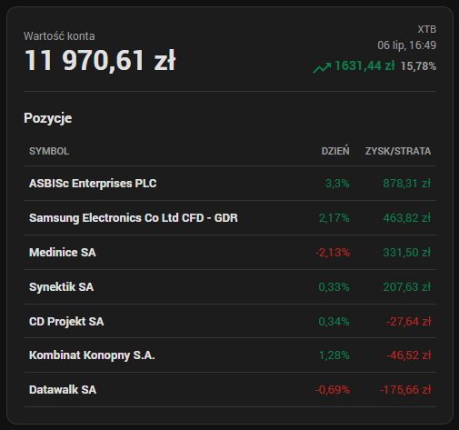

<p align="center">
  
</p>

<h1 align="center">XTB Investments for Home Assistant</h1>

<p align="center">
  <a href="https://github.com/kyvaith/XTB-HA/releases/latest">
    
  </a>
  <a href="https://www.home-assistant.io/">
    
  </a>
  <a href="https://hacs.xyz/">
    
  </a>
  <a href="addons/xtb_bridge">
    
  </a>
  
</p>

Custom integration, Lovelace card and local bridge add-on for read-only XTB investment statistics in Home Assistant.

<p align="center">
  
</p>

## Research summary

XTB discontinued the classic public API access on **2025-03-14**. The old xAPI libraries that use `xapi.xtb.com` or `ws.xtb.com` should be treated as legacy only.

Freshest useful project found on GitHub:

| Project | Status | Notes |
| --- | --- | --- |
| [liskeee/xtb-api-unofficial-python](https://github.com/liskeee/xtb-api-unofficial-python) | Best candidate | Created 2026-03-24, pushed 2026-04-21, PyPI package `xtb-api-python==0.10.0`. Reverse-engineered from xStation5, supports account balance, positions, pending orders, quotes, WebSocket push events, 2FA/TOTP and session refresh. |
| [liskeee/xtb-api-unofficial-ts](https://github.com/liskeee/xtb-api-unofficial-ts) | Useful reference | TypeScript version of the same unofficial approach. |
| [pawelkn/xapi-python](https://github.com/pawelkn/xapi-python) | Legacy | Good older wrapper, but explicitly marked deprecated because old XTB API hosts were discontinued. |
| [MateoGreil/xapi-go](https://github.com/MateoGreil/xapi-go) | Legacy xAPI style | Fresh Go repo, but still appears to target the old documented xAPI pattern. |

XTB's own help center says API access is no longer available and was discontinued on 2025-03-14:
[XTB Help Center](https://www.xtb.com/int/help-center/our-platforms-6-4/does-xtb-offer-investment-automation-tools-4).

## Current architecture

This repository starts as a Home Assistant custom integration, not a trading bot.

- The Home Assistant integration has no Chromium dependency.
- The `addons/xtb_bridge` add-on contains Chromium/Playwright and uses `xtb-api-python==0.10.0`.
- The add-on auto-detects the XTB account number after login.
- Setup is intentionally simple: login and password first, then a one-time OTP step only if XTB asks for it.
- Includes brand assets for Home Assistant, HACS and the add-on store.
- Uses a resilient browser login flow in the bridge for XTB's WAF and OTP screens.
- Lets Home Assistant track a selected XTB account and automatically includes related real accounts in the same currency, such as PLN IKZE alongside the main PLN account.
- Home Assistant polls one normalized investment snapshot through a `DataUpdateCoordinator`.
- Exposes aggregate sensors for account balance, free funds, total profit, profit percent, open position count and pending order count.
- Exposes a compact DeskHub sensor with small `summary` and `rows` attributes for constrained e-paper dashboards.
- Stores detailed positions, orders, quotes and account summary as attributes on the balance sensor.
- Creates instrument-name daily-change sensors and per-position profit/loss sensors.
- Adds a compact dashboard card at `custom_components/xtb_investments/frontend/xtb-investments-card.js` and registers it as a Lovelace module resource automatically.
- Does not expose buy/sell/cancel services.

## Why the bridge exists

The unofficial Python library may require Playwright Chromium during login because XTB can block the direct REST login path with a WAF. Home Assistant Core should not install or manage Chromium inside a custom integration, so the browser part runs in a local add-on container.

## Installation

Install the add-on first:

1. In Home Assistant, add this repository to the add-on store.
2. Install **XTB Bridge**.
3. Start the add-on. It exposes `http://127.0.0.1:8765` to Home Assistant Core.

Install the integration through HACS as a custom integration repository, or copy `custom_components/xtb_investments` to `/config/custom_components/xtb_investments`.

Restart Home Assistant, then add the integration from **Settings > Devices & services > Add integration > XTB Investments**.

Config fields:

- `email`: XTB login/email
- `password`: XTB password

If XTB sends an OTP after the password step, Home Assistant shows a second form for that one-time code. The OTP is not stored. If the OTP challenge expires before the code is submitted, the integration starts a fresh login attempt and shows the OTP form again for the new code from XTB. After a successful OTP login, the bridge keeps a persistent Playwright browser profile under the add-on `/data` directory so later TGT refreshes can reuse the trusted browser state instead of waking you up for another OTP.

If XTB returns more than one account, Home Assistant shows an account selection step. Existing entries without a stored account number use the bridge default: prefer a real PLN account when present.

## Dashboard card

The integration registers `/xtb_investments/xtb-investments-card.js?v=<version>` as a JavaScript module resource automatically. Refresh the browser after updating the integration so the Home Assistant frontend reloads the card picker.

The card shows the account value, total monetary and percentage profit, the last update time and a compact positions table. The top-right card header defaults to `XTB` and can be changed in the card editor or with the `header` YAML option. Separate lots for the same account and instrument are summed into one row, while different accounts remain separate. Positions are sorted from the largest to the smallest monetary profit/loss. Each instrument has a small rounded graphical marker using XTB logo URLs like `https://logos.xtb.com/asb_pl.png`; if a logo is unavailable, the card renders a deterministic ticker avatar. Card elements are clickable: the account value opens the account sensor history, the total profit opens the profit sensor when available, and instrument rows open the matching profit/loss entity history. The positions table intentionally shows only instrument name, daily percent change and monetary profit/loss; cash/free-funds metrics and the separate quotes table are omitted to keep the dashboard card dense.

If your dashboard is in YAML mode or HA blocks automatic resource writes, add this module resource manually:

```yaml
url: /xtb_investments/xtb-investments-card.js?v=0.1.24
type: module
```

Example card:

```yaml
type: custom:xtb-investments-card
entity: sensor.xtb_balance
header: XTB
show_positions: true
show_orders: false
```

Use the actual balance entity ID created by Home Assistant if it differs from the example.

## Entities

The integration creates:

- Balance sensor with the account value shown by XTB and full snapshot attributes
- Free funds sensor
- Profit sensor
- Profit percent sensor
- DeskHub sensor with compact `summary` and up to 20 sorted `rows` for ESPHome/e-paper clients
- Open positions count sensor, disabled by default as a diagnostic entity
- Pending orders count sensor, disabled by default as a diagnostic entity
- Daily percent change sensors for instruments in the initial setup snapshot; values are calculated the same way as xStation5, from `xcloseprice.close1day` and the current tick bid. If XTB does not expose close-price data, the entity remains unavailable instead of showing position return.
- Profit/loss sensors for open positions in the initial setup snapshot

New symbols from later-opened positions still appear in the balance sensor attributes and card after refresh. Reload the integration if you also want separate symbol or position entities for them.

## Safety

This integration is read-only by design. It stores credentials in Home Assistant's config entry storage and sends them only to the local bridge add-on. One-time OTP codes are used only during setup or reauthentication and are not stored. Run it only in a trusted HA instance. Test carefully because XTB's internal API can change without notice.
